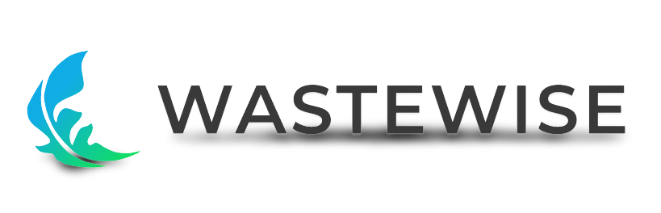

<section id="explicacao_projeto">
    <article>
        <h2>Explicação do Projeto</h2>
        
Essa ideia foi desenvolvida a partir de um desafio proposto pela FIAP. deveríamos propor um projeto que impactasse na "Economia Azul", trazendo possíveis tecnologias ambientais para preservação do Oceano

        
<a href="./assets/GlobalSolution.pdf" style="font-style: italic;">PDF da Global Solution (Engenharia de Software) 1º semestre de 2024</a>

        
<a href="https://www.fiap.com.br/graduacao/global-solution">Site da Global Solution</a>

    </article>
</section>

<section id="simulacao_arduino">
    <article>
        <h2>Simulação com Arduino</h2>
        <h3><a href="https://wokwi.com/projects/399705116640261121" target="_blank" style="font-style: italic">Workwi <i class="fab fa-workwi"></i></a></h3>
        
Simulação de Balança e sensor de capacidade inteligente.

    </article>
</section>

<section id="design_software">
    <article>
        <h2>Design do Software</h2>
        
<a href="https://www.canva.com/design/DAGGi25fhZI/9Kf6AW6fKVvCW5Gfqh-0WQ/edit?utm_content=DAGGi25fhZI&utm_campaign=designshare&utm_medium=link2&utm_source=sharebutton" target="_blank" style="font-style: italic;">Canva do Design Thinking: Pensando e estruturando o projeto</a>

        
Você encontrará: Descrição do <i class="fas fa-users"></i>parceiro, <i class="fas fa-exclamation-triangle"></i> problema, <i class="fas fa-lightbulb"></i> solução e backlog das <i class="fas fa-cogs"></i>funcionalidades do produto.

        
<a href="https://www.canva.com/design/DAGGqL7yX_0/x6OzoOTHhAMoBxRh3UZ1vA/edit?utm_content=DAGGqL7yX_0&utm_campaign=designshare&utm_medium=link2&utm_source=sharebutton" target="_blank" style="font-style: italic;">Canva do Business Model Canvas e Persona.</a>

    </article>
</section>

<section id="integrantes">
    <article>
        <h2>Integrantes</h2>
                <h3>  Pedro Guidotte | RM556630<a href="https://github.com/peguidotte" target="_blank" style="font-style: italic">  /GitHub <i class="fab fa-github"></i></a>
                <a href="https://www.linkedin.com/in/pedro-guidotte/" target="_blank" style="font-style: italic">  /LinkedIn<i class="fab fa-linkedin"></i></a></h3>
                <h3>  Gabriel Vara | RM555355<a href="https://github.com/gabrielvara" target="_blank" style="font-style: italic"> 
 /GitHub <i class="fab fa-github"></i></a>
                <a href="https://www.linkedin.com/in/gabriel-vara" target="_blank" style="font-style: italic">  /LinkedIn <i class="fab fa-linkedin"></i></a></h3>
                <h3>  Leonardo Correa | RM555573<a href="https://github.com/leocorreamello" target="_blank" style="font-style: italic">  /GitHub <i class="fab fa-github"></i></a>
                <a href="https://www.linkedin.com/in/leocorreamello/" target="_blank" style="font-style: italic">  /LinkedIn <i class="fab fa-linkedin"></i></a></h3>
    </article>
</section>
